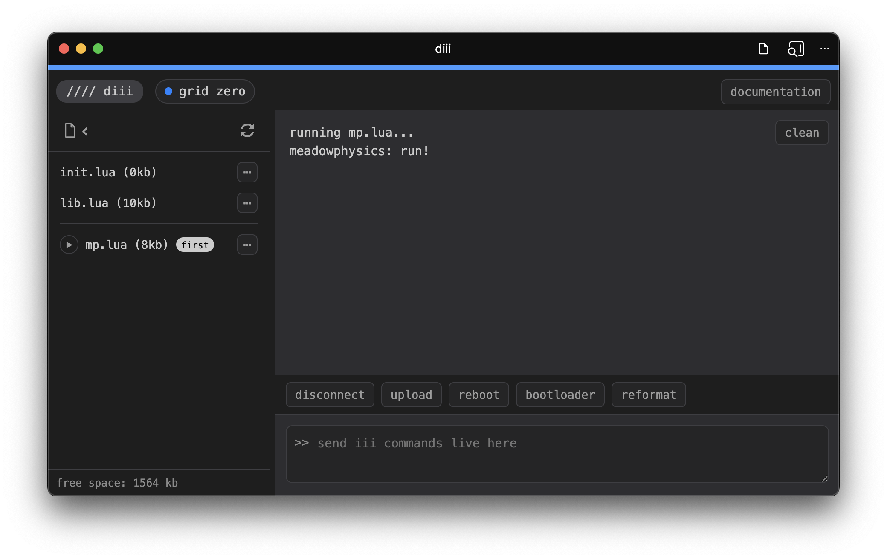

# diii (fka web-diii)

A web-based live-coding and management interface for iii devices, available [here](https://monome.org/diii). The iii sibling of [web-druid](https://github.com/dessertplanet/web-druid) that communicates with [crow](https://monome.org/docs/crow) and is in turn based on the python-based [druid](https://monome.org/docs/crow/druid) terminal app. Send commands, get text feedback, and manage the files on your iii device.

This repo has the source code for this static web app. For docs, go [here](https://monome.org/docs/iii/diii).

## requirements

Uses the Web Serial API that is only available in chromium-based browsers like Chrome, Chromium, Edge, and Opera.

Can be installed as a progressive web app via the install app button in the browser address bar, allowing for use without an internet connection.

## a note for web developers

to run locally for development on the site itself, run this in the web-diii root directory then browse to localhost:8000
```bash
python3 -m http.server 8000
```

This is **not** necessary for using diii offline, see the note above about installing as a progressive web app for the best experience there.
