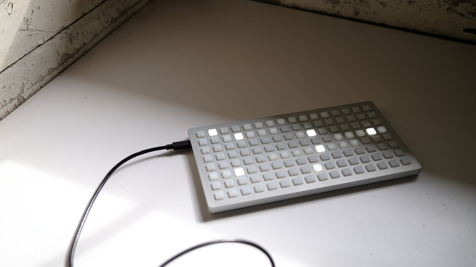
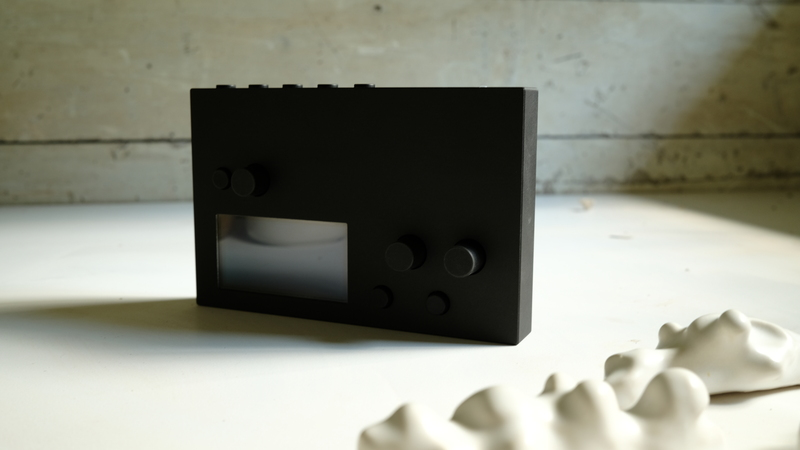
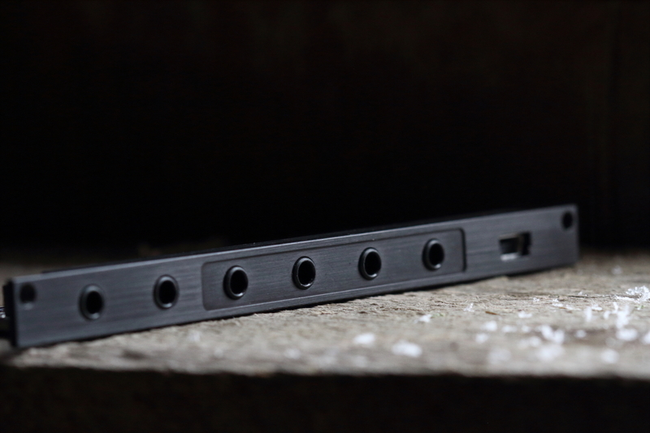
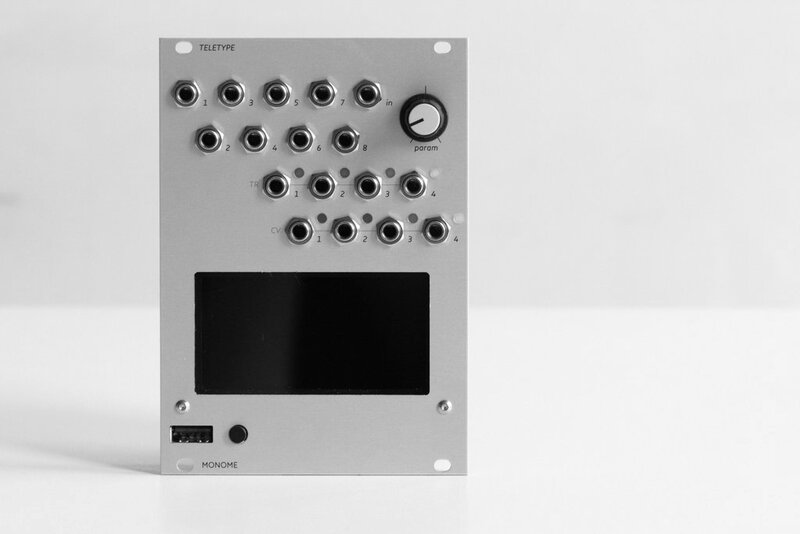
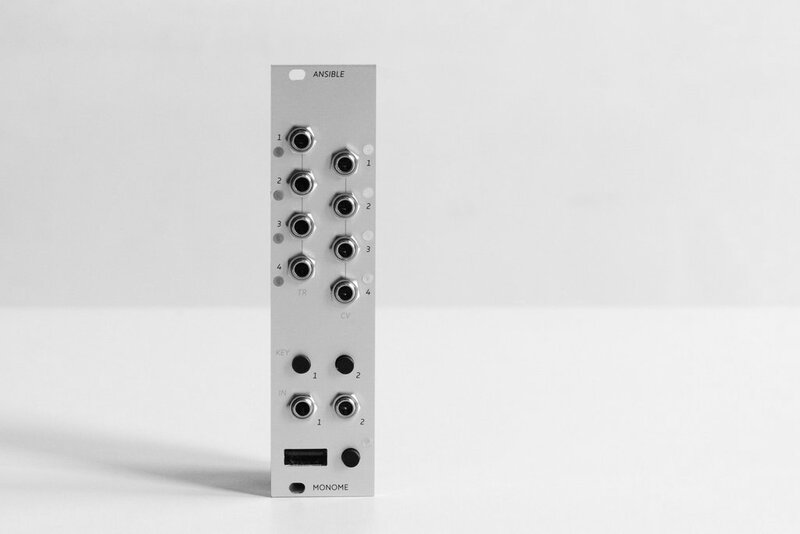
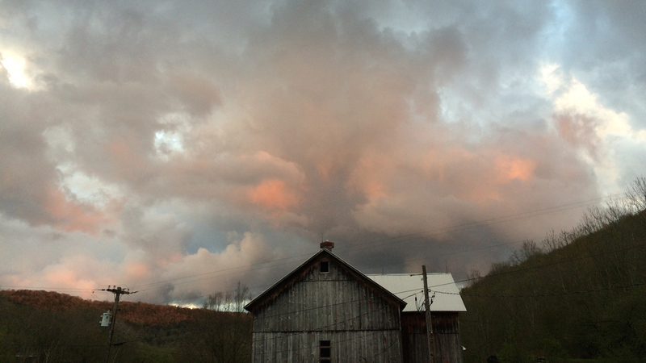

sound machines for 
    the exploration of time 
    and space

 
 
 
 

an open, tactile instrument that allows the user to imagine and define its function.

the monome <i>grid</i> by default does nothing. connected to a computer or module, interaction is determined by the chosen application: sequencer, sample cutter, tone map, polyrhythm machine. we’ve put together studies to help you create your own.

<ul>
  <li><a href="https://vimeo.com/266741634">video</a></li>
  <li><a href="https://monome.org/docs/grid">documentation</a></li>
</ul>

$700 &mdash; sold out. restock date expected for early 2023

<!--G RID-->

changes. travels. is open to possibilities.
 

<i>norns</i> is many sound instruments. it connects to grids, MIDI and other objects. norns lets you define its behavior with scripts and DSP. we've created extensive studies to help actualize new instruments yet to be imagined. 

<ul>
  <li><a href="https://vimeo.com/267112253">video</a></li>
  <li><a href="https://monome.org/docs/norns">documentation</a></li>
</ul>

$900 &mdash; sold out. unknown restock date

<!--N ORNS-->

speaks and listens and remembers bits of text. a scriptable usb-cv-ii machine.

<i>crow</i> connects to norns and computers running max, max for live, and other serial-enabled applications. we've created various norns scripts and max for live devices which require no programming, and we've also created tutorials and studies to get you started quickly programming your own ideas into this tiny, powerful module. 

<ul>
  <li><a href="https://vimeo.com/362620801">video</a></li>
  <li><a href="https://monome.org/docs/crow">documentation</a></li>
</ul>

$200 &mdash; sold out, unknown restock date

algorithmic ecosystem for modular synths.

<i>teletype</i> is a dynamic, musical event triggering platform. edit scripts with a USB keyboard which plugs into the front panel. syntax is simple and easy to learn with the provided tutorials, video, and reference pages. teletype runs without the keyboard attached: you might treat editing as precomposition, or leave the keyboard plugged in for live coding. 

<ul>
  <li><a href="https://vimeo.com/129271731">video</a></li>
  <li><a href="https://monome.org/docs/teletype">documentation</a></li>
</ul>

$400 &mdash; sold out, unknown restock date

far communicator, speaks openly.

<i>ansible</i> connects various USB devices (grid, arc, MIDI) to the modular environment. several modes provide different sequencers and control approaches.

<ul>
  <li><a href="https://monome.org/docs/ansible">documentation</a></li>
</ul>

$280 &mdash; sold out, unknown restock date

we're enduring the semiconductor shortage alongside basically all small manufacturers. this is the reason that we do not have known restock dates for many of our devices. we'll update this site as we learn more. i wrote a <a href="https://llllllll.co/t/scarcity-and-precarity-in-small-manufacturing/55896">longer essay</a> which may be of further interest.

we've also had to increase pricing to accommodate rising costs of components, contract manufacturing, and transportation. in addition to delays we're also encountering quality issues, which contribute a substantial amount of labor to ensure everything is in working order. we'll adjust pricing as the situation changes.

contact help@monome.org with questions.

<a href="https://llllllll.co">llllllll.co</a> is for community discussion.

shipping happens on tuesdays. a tracking number is sent when each order ships. see [shipping updates](/shipping.html) for current status on any waiting preorders.

we're committed to keeping these machines working. email us for repairs. also see purchase <a href="policy.html">policy</a>.

in the <a href="past.html">past</a> we created some other objects.

events and release announcements and stock updates:

<form action="https://tinyletter.com/monome" method="post" target="popupwindow" onsubmit="window.open('https://tinyletter.com/monome', 'popupwindow', 'scrollbars=yes,width=800,height=600');return true">
<input type="text" style="width:240px" name="email" id="tlemail" placeholder="email"/> <input type="hidden" value="1" name="embed"/><input type="submit" value="subscribe" style="width:100px"/>
</form>

 
 

monome is <a href="https://nnnnnnnn.co">brian crabtree</a> and <a href="http://kellicain.com">kelli cain</a>. we met in art school where our initial collaborations included electro-mechanical installations, films, and music. now we live and work in the mountains of upstate new york where we also tend apple orchards, shiitake stacks, and forest paths.

monome is operated on a human scale. we use local suppliers and manufacturers, assemble and test in house, and only sell direct. like our designs, our organization is focussed on adaptability and the long-term. staying small affords us the flexibility to pursue interesting new directions, not simply commodify established trends.

monome is supported by a global community of curious, helpful, and creative people. <a href="https://dndrks.bandcamp.com">dan derks</a> is on the team. all based at <a href="https://luckdragon.space">luck dragon</a>.

we began in 2005. we continue.

