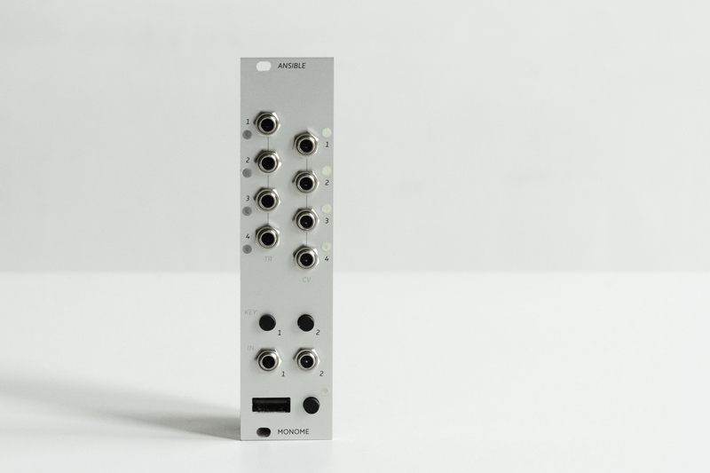

far communicator, speaks openly.

ansible connects various USB devices (grid, arc, MIDI) to the modular environment. several modes provide different sequencers and control approaches.

- [documentation](https://monome.org/docs/ansible)
- [firmware source](https://github.com/monome/ansible)

numerous contributors.

released in 2016. discontinued 2023.

originally $280

