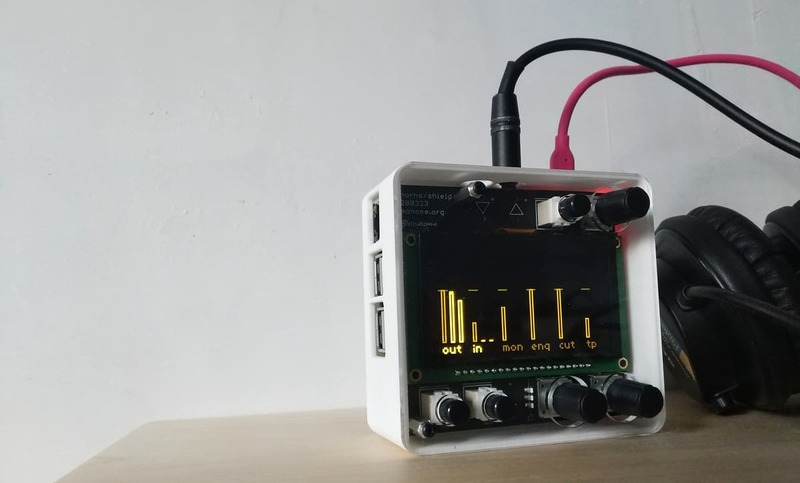

norns shield turns a raspberry pi computer into a norns.

- [documentation](https://monome.org/docs/norns)
- [norns codebase](https://github.com/monome/norns)
- [hardware source](https://github.com/monome/norns-shield)
- [discussion](https://llllllll.co/t/norns-shield-final/58810) 

many contributors.

released in 2019. discontinued in 2022.

began as a DIY kit that requied through-hole soldering. evolved to require no soldering, just some minor assembly. early versions were a plexi sandwich enclosure, later included a printed case.

pricing varied with different configurations over the years.
