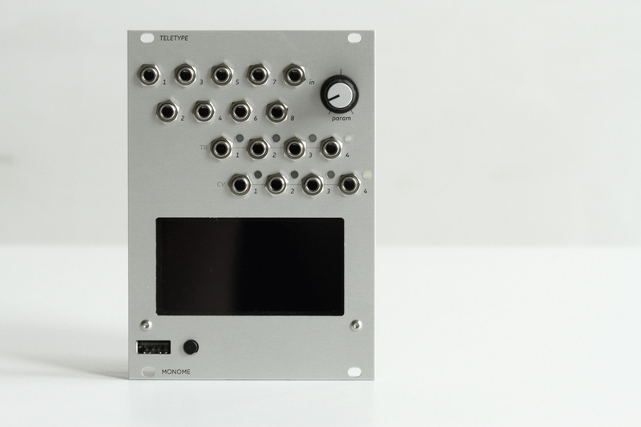

algorithmic ecosystem for modular synths.

teletype is a dynamic, musical event triggering platform. edit scripts with a USB keyboard which plugs into the front panel. syntax is simple and easy to learn with the provided tutorials, video, and reference pages. teletype runs without the keyboard attached: you might treat editing as precomposition, or leave the keyboard plugged in for live coding.

- [video](https://vimeo.com/129271731)
- [documentation](https://monome.org/docs/teletype)
- [firmware source](https://github.com/monome/teletype)
- [hardware source](https://github.com/monome/teletype-hardware)

teletype is open source: both the firmware and hardware.

numerous contributors.

released in 2015. discontinued 2023.

originally $480.
